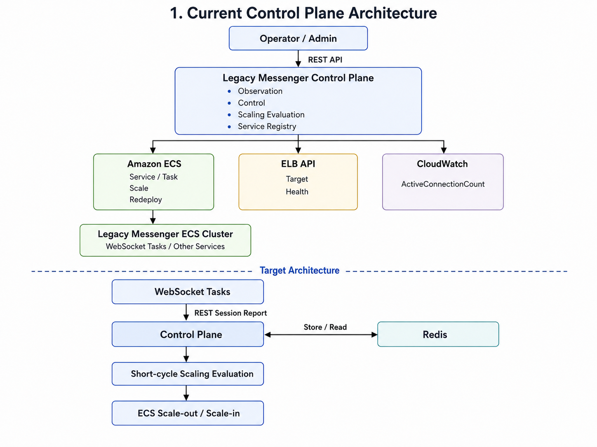

# Legacy Messenger Control Plane

`legacy-messenger-control-plane`은 기존 Java 기반 레거시 메신저의 AWS ECS 운영 기능을 하나의 API 계층으로 통합하고, WebSocket 연결 부하를 기반으로 서비스 확장 필요 여부를 판단하기 위한 Go 기반 Control Plane POC입니다.

## 목차

1. [프로젝트 개요](#1-프로젝트-개요)
2. [프로젝트 배경 및 문제 정의](#2-프로젝트-배경-및-문제-정의)
3. [프로젝트 목표](#3-프로젝트-목표)
4. [주요 기능](#4-주요-기능)
5. [시스템 아키텍처](#5-시스템-아키텍처)
6. [핵심 설계와 기술적 의사결정](#6-핵심-설계와-기술적-의사결정)
7. [API 명세](#7-api-명세)
8. [실행 및 배포 방법](#8-실행-및-배포-방법)
9. [검증 시나리오 및 결과](#9-검증-시나리오-및-결과)
10. [현재 한계 및 후속 검증](#10-현재-한계-및-후속-검증)

## 1. 프로젝트 개요

`legacy-messenger-control-plane`은 기존 Java 기반 레거시 메신저를 AWS ECS 환경에서 운영하는 데 필요한 **관측·제어·스케일링 판단 기능을 Go 기반 REST API로 구현한 Control Plane POC**입니다.

선행 프로젝트인 [Legacy Messenger ECS Ops POC](https://github.com/kipo3195/legacy-messenger-ecs-ops-poc)에서는 서버별로 직접 실행하던 Java 메신저 서비스를 컨테이너 이미지로 전환하고, AWS ECS EC2 환경에서 ECS Service 단위로 배포·운영할 수 있는 기반을 마련했습니다.

그러나 서비스 상태 조회, 실행 중인 Task 확인, Target Health 점검, `desiredCount` 변경, 재배포 등의 운영 작업은 AWS 콘솔, AWS CLI, 개별 Shell Script에 분산되어 있었습니다.

또한 업무용 메신저의 WebSocket 연결은 사용자가 로그인한 동안 장시간 유지되며, 출근 시간대에는 로그인과 연결이 짧은 시간 안에 집중될 수 있습니다. 이러한 서비스는 CPU와 메모리 사용률만으로 실제 세션 부하를 판단하기 어렵기 때문에, 연결 수와 실행 중인 Task 수를 함께 고려하는 스케일링 판단 기준이 필요합니다.

본 프로젝트는 분산된 ECS 운영 기능을 하나의 API 계층으로 통합하고, 다음 역할을 수행하도록 구성했습니다.

| 영역 | 역할                                                       |
| -- | -------------------------------------------------------- |
| 관측 | ECS Service 상태, 실행 중인 Task, Target Health 및 연결 부하 조회     |
| 제어 | ECS Service의 `desiredCount` 변경 및 강제 재배포                  |
| 판단 | 연결 수와 실행 중인 Task 수를 기반으로 Scale-out, Scale-in 또는 유지 여부 계산 |

현재는 ALB의 `ActiveConnectionCount`와 ECS의 실행 Task 수를 이용한 스케일링 판단 로직을 구현했습니다.

향후에는 각 WebSocket Task가 실제 로그인 세션 수를 Control Plane에 직접 보고하고, 해당 값을 기반으로 ECS Service의 `desiredCount`를 자동 조정하는 구조로 확장할 예정입니다.

## 2. 프로젝트 배경 및 문제 정의

### 2.1 레거시 메신저의 ECS 전환

기존 레거시 메신저는 각 서버에서 Java 프로세스를 직접 실행하고, Shell Script와 운영 명령을 이용하여 서비스를 기동·종료·재배포하는 방식으로 운영되었습니다.

선행 프로젝트에서는 Java 서비스를 컨테이너 이미지로 전환하고 AWS ECS EC2 환경에 배포했습니다. 이를 통해 메신저 서비스를 ECS Service와 Task 단위로 실행하고, `desiredCount` 변경과 `forceNewDeployment`를 이용하여 서비스의 실행 수와 배포 상태를 제어할 수 있는 기반을 마련했습니다.

그러나 실행 환경을 ECS로 전환한 것만으로 운영 자동화가 완성된 것은 아니었습니다. 기존의 서버 및 프로세스 중심 운영 방식이 AWS 콘솔, AWS CLI, CloudWatch, 개별 Shell Script를 사용하는 형태로 바뀌었을 뿐, 운영 기능은 여전히 여러 도구에 분산되어 있었습니다.

### 2.2 분산된 ECS 운영 인터페이스

ECS 전환 이후 서비스 운영을 위해 다음 작업이 필요했습니다.

* ECS Service의 `desiredCount`, `runningCount`, `pendingCount` 확인
* 실행 중인 Task 목록과 Task별 상태 확인
* Load Balancer Target Group의 Health 상태 확인
* `desiredCount` 변경을 통한 서비스 기동·종료 및 수평 확장
* `forceNewDeployment`를 이용한 Task 재배포
* CloudWatch 지표를 이용한 서비스 부하 확인

각 작업은 AWS 콘솔, AWS CLI 또는 개별 Shell Script를 통해 수행할 수 있었지만, 이를 하나의 일관된 인터페이스로 제공하는 계층은 존재하지 않았습니다.

이러한 구조에서는 운영자가 여러 AWS 리소스의 상태를 각각 확인해야 하며, 관리자 화면이나 외부 자동화 시스템에서 동일한 운영 기능을 호출하기도 어렵습니다. 또한 서비스별 최소·최대 Task 수와 확장 가능 여부 같은 운영 정책이 명령 실행자나 개별 스크립트에 의존할 수 있습니다.

따라서 ECS, Elastic Load Balancing, CloudWatch에 분산된 운영 정보를 서비스 단위로 조합하고, 관측과 제어 기능을 REST API로 표준화할 필요가 있었습니다.

### 2.3 WebSocket 서비스의 부하 특성

일반적인 HTTP 요청은 대부분 짧은 시간 안에 처리된 후 연결이 종료되지만, WebSocket 연결은 사용자가 로그인한 동안 장시간 유지됩니다.

WebSocket Task는 연결이 유지되는 동안 사용자 세션과 연결 상태를 계속 관리해야 합니다. 특히 업무용 메신저는 출근 시간대에 로그인과 WebSocket 연결이 짧은 시간 안에 집중될 수 있으므로, 신규 연결을 처리할 수 있는 여유 용량을 빠르게 확보해야 합니다.

그러나 CPU와 메모리 사용률만으로는 각 Task가 실제로 몇 개의 사용자 세션을 관리하고 있는지 알기 어렵습니다. CPU 사용률이 낮더라도 이미 많은 장기 연결을 유지하고 있을 수 있으며, 동일한 CPU 사용률을 보이는 Task라도 실제 세션 수는 서로 다를 수 있습니다.

따라서 WebSocket 서비스의 확장 필요 여부를 판단하려면 다음과 같은 연결 중심 지표가 필요합니다.

* 서비스 전체 활성 연결 수
* 실행 중인 WebSocket Task 수
* Task당 평균 연결 수
* Task별 실제 로그인 세션 수
* 서비스별 목표 연결 수
* 서비스별 최소·최대 Task 수

### 2.4 CloudWatch 연결 지표의 한계

현재 POC에서는 ALB의 `ActiveConnectionCount`와 ECS Service의 실행 Task 수를 이용하여 Task당 평균 연결 부하를 계산합니다.

이 지표를 이용하면 전체 연결 수가 현재 실행 중인 Task 수에 비해 높은지 낮은지를 계산하고, Scale-out, Scale-in 또는 현재 상태 유지 여부를 판단하는 구조를 구현할 수 있습니다.

다만 `ActiveConnectionCount`는 Load Balancer가 관측한 네트워크 연결 지표이며, WebSocket 애플리케이션이 관리하는 인증 완료 사용자 세션 수와 동일하지 않습니다.

또한 다음과 같은 한계가 있습니다.

* CloudWatch에 일정 주기로 집계되어 실시간성이 제한됨
* 서비스 전체 연결 수만 확인할 수 있고 Task별 연결 수는 확인할 수 없음
* 특정 Task에 연결이 편중되었는지 판단할 수 없음
* 네트워크 연결과 실제 로그인 세션을 구분할 수 없음

따라서 CloudWatch 연결 지표는 연결 기반 스케일링 판단 흐름을 구현하기 위한 초기 지표로 사용할 수 있지만, 실제 WebSocket 세션 부하를 나타내는 최종 기준으로는 한계가 있습니다.

### 2.5 해결해야 할 문제

본 프로젝트에서는 다음 문제를 해결 대상으로 정의했습니다.

| 구분       | 기존 상태                          | 해결해야 할 문제                          |
| -------- | ------------------------------ | ---------------------------------- |
| 운영 인터페이스 | AWS 콘솔, CLI, Shell Script로 분산  | ECS 운영 기능을 일관된 REST API로 제공        |
| 서비스 관측   | ECS, ELB, CloudWatch 상태를 각각 조회 | 서비스 상태와 부하 정보를 하나의 응답으로 조합         |
| 서비스 제어   | 운영자가 명령을 직접 실행                 | 서비스별 정책을 검증한 후 Task 수 변경 및 재배포 수행  |
| 부하 판단    | CPU·메모리와 ALB 연결 지표 중심          | WebSocket 연결 수와 Task 수를 결합한 부하 판단  |
| 운영 정책    | 실행 명령과 스크립트에 분산                | 최소·최대 Task 수와 확장 가능 여부를 중앙 관리      |
| 스케일링 대응  | 운영자가 지표를 확인하고 수동 조정            | 연결 부하를 기반으로 확장 필요 여부와 권장 Task 수 계산 |

## 3. 프로젝트 목표

본 프로젝트의 목표는 레거시 메신저의 ECS 운영 기능을 Control Plane으로 통합하고, WebSocket 연결 부하를 기반으로 서비스 확장 여부를 판단할 수 있는 구조를 구현하는 것입니다.

주요 목표는 다음과 같습니다.

* ECS Service, Task, Target Health 및 연결 부하를 하나의 REST API 계층에서 조회
* 서비스별 최소·최대 Task 수와 확장 가능 여부를 기준으로 안전하게 `desiredCount` 변경
* 강제 재배포와 스케일링 판단 기능을 표준화된 운영 API로 제공
* 연결 수와 실행 중인 Task 수를 이용하여 Scale-out, Scale-in 또는 유지 여부 계산
* 현재 부하에 적합한 권장 `desiredCount` 반환

현재 단계에서는 CloudWatch의 `ActiveConnectionCount`를 이용한 연결 기반 스케일링 판단 로직과 수동 ECS 제어 기능까지 구현했습니다.

## 4. 주요 기능

### 4.1 ECS 서비스 관측

Control Plane이 관리하는 ECS Service의 현재 운영 상태를 조회합니다.

* 관리 대상 서비스 목록 조회
* ECS Service의 `desiredCount`, `runningCount`, `pendingCount` 확인
* Deployment 상태와 현재 Task Definition 확인
* 실행 중인 Task별 상태, Health 상태 및 배치 정보 조회
* Load Balancer Target Group의 Target Health 상태 조회

ECS와 Elastic Load Balancing에 분산된 정보를 서비스 단위로 조합하여 제공합니다.

### 4.2 WebSocket 연결 부하 조회

WebSocket 서비스의 전체 연결 수와 실행 중인 Task 수를 기준으로 현재 연결 부하를 계산합니다.

* ALB의 `ActiveConnectionCount` 조회
* 현재 실행 중인 ECS Task 수 조회
* Task당 평균 연결 수 계산
* 서비스별 목표 연결 수와 현재 연결 부하 비교
* 현재 연결 압력을 `LOW`, `NORMAL`, `HIGH` 상태로 표현

현재 POC에서는 CloudWatch 연결 지표를 사용하며, 실제 세션 기반 판단은 후속 확장 범위에 포함됩니다.

### 4.3 ECS 서비스 제어

운영자가 ECS Service의 실행 수를 변경하거나 현재 Task를 재배포할 수 있는 기능을 제공합니다.

* `desiredCount` 변경을 통한 서비스 기동 및 종료
* 실행 Task 수를 증가시키는 Scale-out
* 실행 Task 수를 감소시키는 Scale-in
* `forceNewDeployment`를 이용한 Task 순차 재배포
* 서비스별 확장 가능 여부 확인
* 최소·최대 Task 수 범위를 벗어나는 요청 검증

서비스 제어 요청에는 Service Registry에 정의된 운영 정책을 적용하여 잘못된 Task 수 변경을 방지합니다.

### 4.4 연결 부하 기반 스케일링 판단

현재 연결 부하와 서비스별 운영 정책을 결합하여 ECS Service의 확장 필요 여부를 계산합니다.

* 전체 활성 연결 수와 Task당 평균 연결 수 계산
* 목표 연결 수를 기준으로 현재 부하 상태 평가
* `SCALE_OUT`, `SCALE_IN`, `KEEP`, `NOT_SCALABLE` 판단
* 현재 부하에 적합한 권장 `desiredCount` 계산
* 최소·최대 Task 수 범위를 적용한 권장값 보정
* 판단 결과와 판단 사유 제공

현재 기능은 스케일링 권장 결과를 반환하며, 판단 결과에 따라 `desiredCount`를 자동으로 변경하지는 않습니다.

### 4.5 서비스별 운영 정책 관리

Control Plane이 관리할 ECS 서비스와 서비스별 운영 정책을 Service Registry에 정의합니다.

주요 설정 항목은 다음과 같습니다.

* Control Plane에서 사용하는 논리 서비스명
* 실제 AWS ECS Service 이름
* 서비스 확장 가능 여부
* 최소 및 최대 Task 수
* Load Balancer 유형
* Task당 목표 연결 수

Service Registry를 통해 AWS 리소스 정보와 운영 정책을 애플리케이션 코드에서 분리하고, 각 서비스에 동일한 관측·제어·판단 흐름을 적용할 수 있도록 구성했습니다.

## 5. 시스템 아키텍처

`legacy-messenger-control-plane`은 실제 사용자 메시지와 WebSocket 연결을 처리하는 Data Plane과 분리되어, ECS 서비스의 상태를 관측하고 실행 상태를 제어하는 Control Plane으로 동작합니다.

운영자 또는 관리자 시스템은 Control Plane의 REST API를 호출하여 서비스 상태를 조회하고, Task 수를 변경하거나 재배포를 수행합니다. Control Plane은 AWS ECS, Elastic Load Balancing, CloudWatch API에서 필요한 정보를 조회한 뒤 Service Registry에 정의된 운영 정책과 결합하여 처리합니다.



### 5.1 현재 구현 구조

현재 Control Plane은 다음 구성요소와 연동합니다.

| 구성요소                   | 역할                                             |
| ---------------------- | ---------------------------------------------- |
| Amazon ECS             | Service와 Task 상태 조회, `desiredCount` 변경, 강제 재배포 |
| Elastic Load Balancing | Target Group과 Target Health 상태 조회              |
| Amazon CloudWatch      | ALB의 `ActiveConnectionCount` 조회                |
| Service Registry       | 관리 대상 서비스와 최소·최대 Task 수, 확장 가능 여부, 목표 연결 수 관리  |

현재 연결 부하 기반 스케일링 판단 흐름은 다음과 같습니다.

```text
CloudWatch ActiveConnectionCount
                │
                ▼
          Control Plane
                │
                ├── Running Task Count
                ├── Target Connections per Task
                ├── Min / Max Task Count
                └── Scalable Policy
                │
                ▼
        Scaling Evaluation
                │
        ┌───────┼────────┐
        ▼       ▼        ▼
   SCALE_OUT  MAINTAIN  SCALE_IN
```

Control Plane은 CloudWatch에서 조회한 전체 활성 연결 수를 현재 실행 중인 Task 수로 나누어 Task당 평균 연결 수를 계산합니다.

계산된 연결 부하와 Service Registry에 정의된 목표 연결 수 및 최소·최대 Task 수를 비교하여 스케일링 판단 결과와 권장 `desiredCount`를 반환합니다.

### 5.2 Control Plane의 역할과 제어 범위

사용자의 WebSocket 연결은 ALB를 통해 WebSocket ECS Task로 전달되며, Control Plane은 실제 사용자 연결이나 메시지 요청을 직접 처리하지 않습니다.

```text
Messenger Client
        │
        ▼
       ALB
        │
        ▼
WebSocket ECS Tasks
```

Control Plane은 운영자 또는 관리자 시스템의 요청을 받아 AWS API를 통해 ECS Service와 Task 상태를 조회하고, Task 수 변경과 재배포 등의 운영 작업을 수행합니다.

```text
Operator / Admin System
           │
           ▼
      Control Plane
           │
           ▼
        AWS API
           │
           ▼
   ECS / ELB / CloudWatch
```

이를 통해 사용자 트래픽 처리와 운영 제어의 책임을 분리했습니다.

### 5.3 목표 세션 직접 보고 구조

향후에는 각 WebSocket Task가 자신이 관리 중인 실제 로그인 세션 수를 Control Plane에 직접 보고하도록 확장할 예정입니다.

```text
WebSocket Task 1 ─┐
WebSocket Task 2 ─┼── REST Session Report ──▶ Control Plane
WebSocket Task 3 ─┘                              │
                                                ▼
                                              Redis
                                                │
                                                ▼
                                      Short-cycle Evaluation
                                                │
                                                ▼
                                        Amazon ECS API
                                                │
                                                ▼
                                      Scale-out / Scale-in
```

각 WebSocket Task는 서비스명, Task 식별자, 현재 세션 수, 보고 시각을 전달하고, Control Plane은 Redis에 저장된 Task별 최신 세션 정보를 집계하여 스케일링 판단에 사용합니다.

## 6. 핵심 설계와 기술적 의사결정

### 6.1 기존 서비스 제어 방식에서 Control Plane으로 확장

기존 레거시 메신저 운영 환경에는 운영자의 요청에 따라 지정된 Shell Script를 실행하는 Switch Service가 존재했습니다.

기존 Switch Service는 서버에 배포된 메신저 서비스를 기동하거나 종료하는 역할을 담당했으며, 서비스 상태 조회, 실행 인스턴스 확인, Health 상태 점검 또는 부하 기반 확장 판단 기능은 포함하지 않았습니다.

레거시 메신저를 AWS ECS 환경으로 전환한 이후에는 단순한 서비스 기동·종료 외에도 다음 운영 기능이 필요해졌습니다.

* ECS Service와 Task 상태 조회
* Load Balancer Target Health 조회
* `desiredCount` 변경을 통한 Scale-out 및 Scale-in
* `forceNewDeployment`를 이용한 Task 재배포
* 서비스별 최소·최대 Task 수 검증
* 연결 부하를 기반으로 한 스케일링 필요 여부 판단

기존 Switch Service가 AWS CLI 기반 Script를 실행하도록 확장하는 방식도 가능했습니다. 그러나 이 방식은 AWS 리소스 조회, 오류 처리 및 운영 정책이 개별 Script에 분산될 가능성이 있고, 조회 결과와 스케일링 판단 로직을 하나의 흐름으로 연결하기 어렵다고 판단했습니다.

AWS Lambda를 이용하여 `desiredCount` 변경이나 강제 재배포를 수행하는 방식도 대안이 될 수 있습니다. 호출 빈도가 낮고 요청 단위로 종료되는 단순 운영 작업은 Lambda로 충분히 구현할 수 있습니다.

다만 본 프로젝트는 여러 AWS 리소스의 상태를 조합하고 서비스별 정책을 적용하여 스케일링 판단까지 수행하며, 향후 WebSocket Task의 실제 세션 수를 수신하고 짧은 주기로 확장 여부를 평가하는 구조까지 고려합니다.

따라서 단발성 명령 실행보다 지속적으로 확장 가능한 독립 Go 애플리케이션 형태의 Control Plane을 선택했습니다.

### 6.2 Service Registry 기반 서비스 및 운영 정책 관리

Control Plane이 관리할 서비스와 서비스별 운영 정책은 코드에 직접 작성하지 않고 Service Registry로 분리했습니다.

Service Registry에는 다음 정보를 정의합니다.

* Control Plane에서 사용하는 논리 서비스명
* 실제 AWS ECS Service 이름
* 서비스 확장 가능 여부
* 최소 및 최대 Task 수
* Load Balancer 유형
* Task당 목표 연결 수

외부 API에서는 `ws`, `ds`, `ns`와 같은 논리 서비스명을 사용하고, 실제 AWS 리소스 이름과의 매핑은 Service Registry가 담당합니다.

또한 스케일 요청을 처리할 때 요청받은 값을 그대로 AWS ECS에 전달하지 않고, 대상 서비스가 확장 가능한지와 요청한 Task 수가 최소·최대 범위 안에 있는지를 검증합니다.

이를 통해 새로운 관리 대상을 추가하거나 서비스별 운영 정책을 변경할 때 핵심 업무 로직의 수정을 최소화하도록 구성했습니다.

### 6.3 Use Case와 AWS Adapter의 책임 분리

Control Plane은 HTTP 처리, 운영 규칙, 외부 AWS 연동의 책임을 분리하여 구성했습니다.

```text
HTTP Handler
      │
      ▼
Application Use Case
      │
      ▼
Port Interface
      │
      ▼
AWS SDK Adapter
```

각 계층의 역할은 다음과 같습니다.

| 계층                   | 역할                                       |
| -------------------- | ---------------------------------------- |
| HTTP Handler         | 요청 파라미터 검증, 요청 객체 변환, HTTP 응답 생성         |
| Application Use Case | 서비스 조회, 스케일 조정, 연결 부하 계산 등 업무 흐름 처리      |
| Port Interface       | Application 계층에서 필요한 외부 기능을 인터페이스로 정의    |
| AWS Adapter          | AWS SDK를 이용한 ECS, ELB, CloudWatch API 호출 |

Application Use Case가 AWS SDK의 요청 및 응답 타입을 직접 다루지 않도록 하고, Adapter가 AWS 응답을 내부에서 사용하는 도메인 구조로 변환하도록 구성했습니다.

이를 통해 핵심 업무 로직이 특정 AWS SDK 구현에 강하게 결합되는 것을 줄이고, 테스트 시 실제 AWS 호출 대신 Mock 구현을 사용할 수 있도록 했습니다.

### 6.4 AWS 리소스 정보를 서비스 단위로 조합

Control Plane은 AWS API 응답을 그대로 전달하는 단순 Proxy가 아니라, 운영에 필요한 정보를 서비스 단위로 조합하는 역할을 담당합니다.

하나의 메신저 서비스 상태를 판단하기 위해서는 여러 AWS 리소스의 정보가 필요합니다.

| 정보                       | 조회 대상                  |
| ------------------------ | ---------------------- |
| 현재 Task 수와 Deployment 상태 | Amazon ECS             |
| 실행 중인 Task 상세 상태         | Amazon ECS             |
| Load Balancer Target 상태  | Elastic Load Balancing |
| 전체 활성 연결 수               | Amazon CloudWatch      |
| 최소·최대 Task 수와 목표 연결 수    | Service Registry       |

운영자는 개별 AWS 리소스보다 특정 서비스가 정상적으로 실행 중인지, 몇 개의 Task가 동작하는지, 현재 연결 부하가 어느 수준인지와 같은 서비스 관점의 정보를 필요로 합니다.

따라서 Control Plane은 여러 AWS API의 조회 결과와 Service Registry의 정책을 조합하여 서비스 상태, 연결 압력 및 권장 Task 수를 계산하도록 설계했습니다.

### 6.5 WebSocket 연결 수 기반 부하 판단

WebSocket 서비스는 사용자가 로그인한 동안 장시간 연결을 유지하므로, CPU와 메모리 사용률만으로 실제 연결 부하를 판단하기 어렵습니다.

현재 POC에서는 다음 값으로 Task당 평균 연결 부하를 계산합니다.

```text
Task당 평균 연결 수
= 전체 ActiveConnectionCount / 실행 중인 Task 수
```

계산된 값은 Service Registry에 정의된 Task당 목표 연결 수와 비교하여 현재 연결 압력과 권장 Task 수를 판단하는 데 사용합니다.

다만 평균 연결 수는 특정 Task에 연결이 편중되는 상황을 확인할 수 없으므로, 실제 세션 기반 구조에서는 Task별 보고 값을 함께 사용해야 합니다.

### 6.6 CloudWatch 지표를 초기 판단 기준으로 선택

현재 구현에서는 ALB의 `ActiveConnectionCount`를 연결 부하 계산에 사용합니다.

CloudWatch 지표를 선택한 이유는 별도의 WebSocket 애플리케이션 수정 없이 기존 AWS 환경에서 바로 조회할 수 있으며, 연결 수를 기반으로 스케일링을 판단하는 전체 흐름을 먼저 구현할 수 있기 때문입니다.

다만 `ActiveConnectionCount`는 실제 로그인 세션 수와 정확히 일치하지 않고 Task별 분포도 제공하지 않습니다.

따라서 CloudWatch 지표를 최종 자동 스케일링 기준으로 선택한 것이 아니라, 연결 기반 판단 로직과 API 구조를 구현하기 위한 초기 지표로 사용했습니다.

### 6.7 스케일링 판단과 실행의 분리

현재 스케일링 판단 기능은 부하 상태를 분석하여 권장 결과를 반환하며, 판단 즉시 ECS Service의 Task 수를 자동으로 변경하지 않습니다.

```text
연결 지표 수집
      │
      ▼
스케일링 판단
      │
      ├── SCALE_OUT
      ├── MAINTAIN
      └── SCALE_IN
      │
      ▼
권장 desiredCount 반환
```

판단과 실행을 분리한 이유는 POC 단계에서 계산 결과를 먼저 검증하고, 잘못된 지표나 일시적인 부하 변화로 인해 실제 서비스의 Task 수가 즉시 변경되는 것을 방지하기 위해서입니다.

특히 Scale-in은 실행 중인 WebSocket 연결에 영향을 줄 수 있으므로 단순히 현재 연결 수가 낮다는 이유만으로 즉시 수행해서는 안 됩니다.

자동 실행 단계에서는 다음과 같은 안정화 정책이 필요합니다.

* Scale-out 및 Scale-in Cooldown
* 임계치 연속 초과 또는 미달 횟수
* 최소 여유 용량 확보
* 마지막 스케일링 수행 시각 확인
* 중복 스케일링 요청 방지
* Scale-in 대상 Task의 연결 종료 및 Drain 처리

### 6.8 Redis 기반 최신 세션 상태 저장

향후 실제 세션 기반 구조에서는 각 WebSocket Task가 보고한 최신 세션 수를 Redis에 저장할 예정입니다.

Redis를 선택한 이유는 다음과 같습니다.

* Task별 최신 세션 수를 빠르게 저장하고 조회할 수 있음
* TTL을 이용하여 종료되거나 보고가 중단된 Task의 오래된 데이터를 제거할 수 있음
* Control Plane이 여러 인스턴스로 실행되더라도 동일한 상태를 공유할 수 있음
* 영구 이벤트 보존보다 최신 상태가 중요한 세션 지표의 특성과 적합함
* 짧은 주기의 집계와 스케일링 평가에 활용하기 쉬움

Redis에 저장된 Task별 세션 수는 Service Registry의 최소·최대 Task 수, 목표 세션 수, Cooldown 등의 정책과 결합하여 스케일링 판단에 사용합니다.

## 7. API 명세

Control Plane은 ECS 서비스의 관측, 제어 및 스케일링 판단을 위한 REST API를 제공합니다.

### 7.1 API 목록

| 구분 | Method | Endpoint                                             | 설명                             |
| -- | ------ | ---------------------------------------------------- | ------------------------------ |
| 관측 | GET    | `/api/v1/services`                                   | 관리 대상 서비스 목록 조회                |
| 관측 | GET    | `/api/v1/services/{serviceName}/status`              | 특정 ECS Service 상태 조회           |
| 관측 | GET    | `/api/v1/services/{serviceName}/tasks`               | 실행 중인 Task 목록 및 상태 조회          |
| 관측 | GET    | `/api/v1/services/{serviceName}/target-health`       | Target Group Health 상태 조회      |
| 관측 | GET    | `/api/v1/services/{serviceName}/connection-pressure` | 연결 수 기반 Task 부하 조회             |
| 제어 | POST   | `/api/v1/services/{serviceName}/scale`               | ECS Service의 `desiredCount` 변경 |
| 제어 | POST   | `/api/v1/services/{serviceName}/redeploy`            | ECS Service 강제 재배포             |
| 판단 | POST   | `/api/v1/services/{serviceName}/scaling-evaluate`    | 연결 부하 기반 스케일링 필요 여부 판단         |

상세 요청 및 응답 형식은 [API 상세 문서](./docs/api/README.md)를 참고합니다.

## 8. 실행 및 배포 방법

`legacy-messenger-control-plane`은 로컬에서 직접 실행하거나 Linux 실행 파일 또는 Docker 컨테이너 형태로 실행할 수 있습니다.

Control Plane 자체는 ECS Service로 배포하지 않으며, 별도 실행 환경에서 AWS SDK를 통해 ECS, ELB, CloudWatch 리소스를 조회하고 제어합니다.

### 8.1 로컬 실행

의존성을 설치한 후 애플리케이션을 실행합니다.

```bash
go mod tidy
go run .
```

실행 환경에는 AWS Region, ECS Cluster, Service Registry 경로 등의 설정이 필요합니다.

```bash
export AWS_REGION=ap-northeast-2
export ECS_CLUSTER_NAME=xxxxxx-cluster
export SERVICE_REGISTRY_PATH=./configs/services.yaml

go run .
```

AWS 인증 상태는 다음 명령으로 확인할 수 있습니다.

```bash
aws sts get-caller-identity
```

### 8.2 Linux 실행 파일 빌드

Linux AMD64 서버에서 실행할 바이너리를 빌드합니다.

```bash
CGO_ENABLED=0 GOOS=linux GOARCH=amd64 \
go build -o legacy-messenger-control-plane .
```

빌드된 실행 파일과 설정 파일을 서버에 전달한 후 실행합니다.

```bash
chmod +x legacy-messenger-control-plane
./legacy-messenger-control-plane
```

현재 POC에서는 이 방식으로 Control Plane을 Linux 서버에서 실행하고 AWS 리소스 조회 및 제어 기능을 검증했습니다.

### 8.3 Docker 실행

Docker 이미지를 빌드합니다.

```bash
docker build -t legacy-messenger-control-plane:latest .
```

환경 설정을 전달하여 컨테이너를 실행합니다.

```bash
docker run --rm \
  --name legacy-messenger-control-plane \
  -p 8080:8080 \
  --env-file .env \
  legacy-messenger-control-plane:latest
```

로컬 AWS Credentials를 사용하는 경우 테스트 목적으로 AWS 설정 디렉터리를 마운트할 수 있습니다.

```bash
docker run --rm \
  --name legacy-messenger-control-plane \
  -p 8080:8080 \
  --env-file .env \
  -v "$HOME/.aws:/root/.aws:ro" \
  legacy-messenger-control-plane:latest
```

운영 환경에서는 Access Key를 애플리케이션에 직접 저장하기보다 EC2 Instance Role 등의 IAM Role을 사용하는 방식을 권장합니다.

자세한 Linux 서버 실행 및 배포 방법은 [`docs/deployment/run-and-deployment.md`](docs/deployment/run-and-deployment.md)를 참고합니다.

## 9. 검증 시나리오 및 결과

본 POC에서는 Control Plane이 AWS ECS 환경에서 실행되는 레거시 메신저 서비스의 상태를 조회하고, 주요 운영 제어 기능을 수행할 수 있는지 검증했습니다.

Control Plane을 Linux 서버에서 실행한 뒤 REST API를 호출하고, API 응답과 AWS ECS Console 및 Target Group에서 확인한 실제 리소스 상태를 비교했습니다.

현재 검증 범위는 다음과 같습니다.

* 관리 대상 서비스 목록 조회
* ECS Service 및 Task 상태 조회
* Load Balancer Target Health 조회
* ECS Service의 `desiredCount` 변경
* ECS Service 강제 재배포

WebSocket Task의 실제 세션 수를 Control Plane에 전달하고, 이를 기준으로 스케일링 필요 여부를 판단하는 기능은 현재 검증 범위에서 제외했습니다.

### 9.1 검증 환경

| 구분            | 구성                              |
| ------------- | ------------------------------- |
| Control Plane | Go 기반 REST API                  |
| 실행 환경         | Linux 서버에서 바이너리 직접 실행           |
| 관리 대상         | AWS ECS EC2 기반 레거시 메신저 서비스      |
| AWS Region    | `ap-northeast-2`                |
| ECS Cluster   | `xxxxxx-cluster`                |
| 주요 검증 대상      | WebSocket ECS Service           |
| 검증한 AWS 연동    | ECS API, ELB API                |
| 후속 검증 대상      | CloudWatch 연결 부하, 실제 세션 기반 스케일링 |
| API 호출 도구     | curl, Postman                   |

Control Plane 자체는 ECS Service로 배포하지 않고 Linux 서버에서 실행했습니다.

Control Plane은 서버에 설정된 AWS 인증 정보와 IAM 권한을 이용하여 AWS SDK로 ECS 및 ELB 리소스를 조회하고 제어했습니다.

### 9.2 검증 시나리오 요약

| 번호 | 검증 시나리오           | 검증 내용                               | 결과 |
| -- | ----------------- | ----------------------------------- | -- |
| 1  | 관리 대상 서비스 조회      | Service Registry에 등록된 서비스 목록 확인     | 성공 |
| 2  | ECS Service 상태 조회 | Desired, Running, Pending Task 수 확인 | 성공 |
| 3  | 실행 Task 조회        | Task 실행 상태 및 배치 정보 확인               | 성공 |
| 4  | Target Health 조회  | Load Balancer Target 상태 확인          | 성공 |
| 5  | 서비스 Scale-out     | `desiredCount` 증가와 신규 Task 실행 확인    | 성공 |
| 6  | 서비스 Scale-in      | `desiredCount` 감소와 Task 종료 확인       | 성공 |
| 7  | 서비스 재배포           | `forceNewDeployment`를 통한 Task 교체 확인 | 성공 |

조회 API는 반환된 값이 실제 AWS 리소스 상태와 일치하는지를 확인했습니다.

제어 API는 요청 성공 여부뿐 아니라 ECS Service, Task 및 Target Group에 실제 변경 사항이 반영되는지를 함께 확인했습니다.

### 9.3 관리 대상 서비스 조회

#### 검증 목적

Control Plane이 Service Registry에 등록된 관리 대상 서비스 목록을 정상적으로 반환하는지 확인했습니다.

#### 요청

```http
GET /api/v1/services
```

#### 확인 항목

* Service Registry에 등록된 서비스만 반환되는지
* 논리 서비스 이름과 실제 ECS Service 이름이 올바르게 연결되는지
* 서비스별 주요 운영 설정이 반환되는지

#### 검증 결과

Service Registry에 정의된 서비스 목록과 운영 설정이 API 응답에 정상적으로 반환되었습니다.

이를 통해 외부 API에서 사용하는 논리 서비스 이름과 AWS의 실제 ECS Service 이름을 분리하고, Control Plane의 관리 대상을 등록된 서비스로 제한할 수 있음을 확인했습니다.

### 9.4 ECS Service 상태 조회

#### 검증 목적

Control Plane이 AWS ECS API를 통해 특정 ECS Service의 현재 상태를 조회할 수 있는지 확인했습니다.

#### 요청

```http
GET /api/v1/services/{serviceName}
```

#### 확인 항목

* `desiredCount`, `runningCount`, `pendingCount`
* 현재 적용된 Task Definition
* 서비스 및 Deployment 상태

#### 검증 결과

API에서 반환한 Task 수와 Task Definition 정보가 AWS ECS Console의 실제 Service 상태와 일치했습니다.

이를 통해 서비스가 목표한 Task 수만큼 실행되고 있는지와 현재 적용된 배포 상태를 Control Plane에서 확인할 수 있었습니다.

### 9.5 실행 Task 조회

#### 검증 목적

특정 ECS Service에서 실행 중인 Task 목록과 개별 Task의 상태를 조회할 수 있는지 확인했습니다.

#### 요청

```http
GET /api/v1/services/{serviceName}/tasks
```

#### 확인 항목

* 실행 중인 Task 목록과 Task ID
* Task의 실행 및 Health 상태
* Availability Zone과 Container Instance 배치 정보

#### 검증 결과

API에서 반환한 Task 목록과 실행 상태가 AWS ECS Console에서 확인한 정보와 일치했습니다.

또한 Task별 Availability Zone과 Container Instance 정보를 통해 각 Task가 실제로 어느 위치에 배치되었는지 확인할 수 있었습니다.

### 9.6 Target Health 조회

#### 검증 목적

ECS Task가 Load Balancer의 Target Group에 등록되어 실제 트래픽을 처리할 수 있는 상태인지 확인했습니다.

ECS Task가 `RUNNING` 상태이더라도 Target Group Health Check를 통과하지 못하면 정상적인 서비스 상태로 보기 어렵습니다.

#### 요청

```http
GET /api/v1/services/{serviceName}/target-health
```

#### 확인 항목

* 서비스와 연결된 Target Group
* 등록된 Target 목록
* Target별 Health 상태와 실패 사유

#### 검증 결과

API에서 반환한 Target Group과 Target Health 상태가 AWS Console에서 확인한 값과 일치했습니다.

이를 통해 ECS Task의 실행 여부뿐 아니라 Load Balancer를 통해 실제 요청을 처리할 수 있는 상태인지 함께 확인할 수 있었습니다.

### 9.7 ECS Service Scale-out 및 Scale-in 검증

#### 검증 목적

Control Plane을 통해 ECS Service의 `desiredCount`를 변경하고, 실제 실행 Task 수가 요청한 값에 맞게 조정되는지 확인했습니다.

#### 요청

```http
POST /api/v1/services/{serviceName}/scale
```

```json
{
  "desiredCount": 3,
  "reason": "scale-out verification"
}
```

#### 확인 항목

* 요청한 값으로 `desiredCount`가 변경되는지
* Scale-out 시 신규 Task가 정상적으로 실행되는지
* Scale-in 시 종료 대상 Task가 Target Group에서 제외되는지

#### 검증 결과

Scale-out 요청 후 `desiredCount`가 증가하고 신규 Task가 `RUNNING` 상태로 전환되는 것을 확인했습니다. 신규 Task는 Health Check를 통과한 뒤 Target Group의 트래픽 처리 대상에 포함되었습니다.

Scale-in 요청 후에는 `desiredCount`가 감소하고 종료 대상 Task가 Target Group에서 제외되었습니다. 최종 `runningCount`가 변경된 `desiredCount`와 일치하는 것을 확인했습니다.

### 9.8 ECS Service 재배포 검증

#### 검증 목적

Control Plane API를 통해 ECS Service의 `forceNewDeployment`를 실행하고, 기존 Task가 신규 Task로 교체되는지 확인했습니다.

재배포 기능은 동일한 Task Definition을 기준으로 현재 실행 중인 Task를 다시 기동해야 하는 경우 사용할 수 있습니다.

#### 요청

```http
POST /api/v1/services/{serviceName}/redeploy
```

#### 확인 항목

* 신규 Deployment가 생성되는지
* 신규 Task가 정상적으로 실행되는지
* 기존 Task가 신규 Task로 교체되는지

#### 검증 결과

Redeploy API 호출 이후 ECS Service에 신규 Deployment가 생성되었습니다.

신규 Task가 실행되고 Target Group Health Check를 통과한 뒤 기존 Task가 종료되는 것을 확인했습니다.

재배포 전후의 Task ID와 시작 시각이 달라진 것을 통해 기존 Task가 실제로 신규 Task로 교체되었음을 확인했습니다.

### 9.9 현재 검증 결과

현재 검증을 통해 Control Plane의 기본 관측 및 제어 기능이 AWS ECS 환경에서 정상적으로 동작함을 확인했습니다.

* Service Registry에 등록된 관리 대상 서비스를 조회할 수 있습니다.
* ECS Service와 실행 중인 Task 상태를 조회할 수 있습니다.
* Target Health를 통해 실제 트래픽 처리 가능 여부를 확인할 수 있습니다.
* `desiredCount` 변경을 통해 ECS Service를 Scale-out 및 Scale-in할 수 있습니다.
* `forceNewDeployment`를 통해 실행 중인 Task를 순차적으로 교체할 수 있습니다.
* API 응답과 AWS Console에서 확인한 실제 상태 및 변경 결과가 일치했습니다.

이번 검증에서는 Control Plane이 AWS ECS 및 ELB 상태를 올바르게 조회하는지와 운영자의 명시적인 제어 요청이 실제 AWS 리소스에 반영되는지를 중심으로 확인했습니다.

## 10. 현재 한계 및 후속 검증

현재 POC에서는 AWS ECS와 ELB를 이용한 서비스 관측 및 제어 기능을 검증했고, CloudWatch 연결 지표를 기반으로 한 스케일링 판단 로직까지 구현했습니다.

다만 실제 동시 접속 환경에서의 판단 정확도와 판단 결과에 따른 자동 ECS 확장은 아직 검증하지 않았습니다.

또한 현재 사용하는 ALB의 `ActiveConnectionCount`는 실제 로그인 세션 수와 Task별 세션 분포를 정확하게 나타내지 못하므로, 자동 스케일링의 최종 기준으로 사용하기에는 한계가 있습니다.

향후에는 각 WebSocket Task가 자신이 관리 중인 실제 세션 수를 Control Plane에 직접 보고하고, Control Plane이 이를 Redis에 저장·집계하도록 확장할 예정입니다.

해당 구조가 완성되면 수천 명 규모의 동시 접속 환경에서 다음 내용을 검증합니다.

* WebSocket 세션 수와 Control Plane 집계 결과의 일치 여부
* `POST /api/v1/services/{serviceName}/scaling-evaluate` 판단 결과의 정확성
* 접속 증가 시 Scale-out 판단과 신규 Task 투입까지의 반응 시간
* 접속 감소 시 Cooldown과 연결 Drain을 적용한 Scale-in 안정성
* Task별 세션 편중과 보고 중단 Task의 TTL 처리
* 스케일링 판단 결과와 실제 ECS `desiredCount` 변경의 연계

부하 테스트 과정에서 의미 있는 운영 이슈가 확인되면 원인, 대응 과정 및 검증 결과를 별도 트러블슈팅 사례로 정리할 예정입니다.
